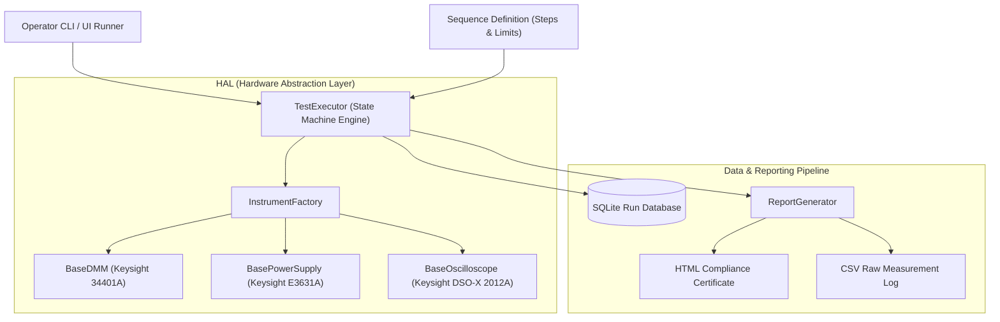

# ⚙️ OpenATE — Modular Automated Test Equipment & Instrument HAL Framework

[](https://python.org)
[](https://github.com/kiran10299/OpenATE-Engine)
[](https://pytest.org)
[](https://github.com/kiran10299)

An open-source, production-grade **Automated Test Equipment (ATE) Execution Framework** designed for multi-channel test benches, high-speed qualification sequences, hardware abstraction, and automated compliance reporting.

---

## 🏛️ System Architecture



---

## 🌟 Key Capabilities

1. **Hardware Abstraction Layer (HAL):**
   * Decouples test sequences from physical instrument vendors.
   * Unified interfaces for **DC Power Supplies, Digital Multimeters (DMM), Oscilloscopes**, and Switching Matrices.
   * Comes with **100% simulated high-fidelity drivers** mimicking real SCPI command sets and measurement noise so engineers can develop test sequences without physical hardware.

2. **Automated Sequence Engine:**
   * Configurable pre-test sanity checks, nominal test execution, and safe teardown.
   * Limit evaluation with standard engineering tolerances: Min, Max, Range (`GELE`), Equality, and Abort-on-Fail policies.
   * Context dictionary sharing data across steps (e.g. measuring $V_{\text{in}}$ in Step 2 to compute efficiency $\eta$ in Step 8).

3. **Enterprise Compliance Reporting:**
   * Automatically renders responsive **HTML Test Certificates** with pass/fail badges, metadata headers, and test execution duration.
   * Generates machine-readable **CSV Logs** for statistical process control (SPC) and production yield analysis.
   * Records every test run, measurement, and operator sign-off into an indexed **SQLite Database** (`open_ate_results.db`).

4. **Robust Engineering Quality:**
   * Built-in unit test suite via `pytest`.
   * Type annotations across all public APIs.

---

## 📂 Project Structure

```
OpenATE-Engine/
├── open_ate/
│   ├── hal/                  # Hardware Abstraction Layer
│   │   ├── base.py           # Abstract Base Instrument Classes
│   │   ├── sim_psu.py        # Simulated DC Power Supply Driver
│   │   ├── sim_dmm.py        # Simulated 6.5-Digit DMM Driver
│   │   ├── sim_scope.py      # Simulated Digital Oscilloscope Driver
│   │   └── factory.py        # Driver Factory & Registry
│   ├── core/                 # Test Execution Engine
│   │   ├── sequence.py       # TestStep, Limits, and Result Models
│   │   ├── executor.py       # Sequence Execution State Machine
│   │   └── database.py       # SQLite Time-Series Database Manager
│   ├── reporting/            # Compliance Output
│   │   └── report_generator.py # HTML & CSV Report Builders
│   └── ui/                   # Operator Interfaces
│       └── cli_runner.py     # Terminal Progress Tree & HUD
├── tests/                    # Unit Tests
│   ├── test_hal.py
│   └── test_executor.py
├── run_ate.py                # Reference PDU Qualification Test
└── README.md
```

---

## 🚀 Quick Start

1. **Clone the repository:**
   ```bash
   git clone https://github.com/kiran10299/OpenATE-Engine.git
   cd OpenATE-Engine
   ```

2. **Run the DC-DC Converter Qualification Sequence:**
   ```bash
   python run_ate.py UUT-SN-2026-001
   ```

3. **Run Unit Tests:**
   ```bash
   python -m pytest tests/
   ```

---

## 📊 Sample Test Sequence Execution

```text
===========================================================================
OpenATE Test Executive | Senior Test Engineering Framework
Sequence : PDU_DC_DC_Converter_Full_Qualification
UUT S/N  : UUT-PDU-2026-9904
===========================================================================

STATUS   | STEP NAME                              | MEASURED     | LIMITS
---------------------------------------------------------------------------
[PASS]   | Ground_Bonding_Resistance              | 0.1799 Ohm   | >= 0.0 and <= 0.5 Ohm
[PASS]   | Input_Rail_Voltage_Setup               | 11.9371 V    | >= 11.8 and <= 12.2 V
[PASS]   | Standby_Quiescent_Current              | 19.1000 mA   | >= 5.0 and <= 35.0 mA
[PASS]   | Regulated_5V_Logic_Rail                | 5.0206 V     | >= 4.9 and <= 5.1 V
[PASS]   | Regulated_3.3V_MCU_Rail                | 3.3083 V     | >= 3.25 and <= 3.35 V
[PASS]   | 5V_Rail_Ripple_Noise_Vpp               | 37.5194 mV   | >= 0.0 and <= 60.0 mV
[PASS]   | Switching_Frequency_PWM                | 500.2702 kHz | >= 485.0 and <= 515.0 kHz
[PASS]   | Power_Conversion_Efficiency            | 90.6715 %    | >= 85.0 and <= 98.0 %
---------------------------------------------------------------------------

FINAL VERDICT : PASSED
Total Steps   : 8 (Passed: 8, Failed: 0, Errors: 0)
Execution Time: 0.288 seconds
```

---

## 👨‍💻 Author

**Kiran Shivakumar**  
*Application Engineer | LabVIEW, Test & Measurement & Robotics*  
* 🌐 **Portfolio Website:** [kiran10299.github.io](https://kiran10299.github.io)  
* 💼 **LinkedIn:** [linkedin.com/in/kiranshivakumar](https://www.linkedin.com/in/kiranshivakumar)  
* 🐙 **GitHub:** [@kiran10299](https://github.com/kiran10299)
